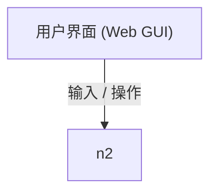

# arch-canvas · 架构画布

人与 AI 共用**同一张 Mermaid 架构图**的 DSH 插件。

用户在右侧栏的画布上直接拖节点、拉连线、改属性；AI 读到的是同一张图的 Mermaid 文本。
用户在图上动一下，AI 下一步就能看见；AI 改一处，用户那边立刻跟着动，**而且能看到它改的是哪几个节点**。

```
        ┌────────── 用户 ──────────┐          ┌─────────── AI ───────────┐
        │  右侧栏「架构画布」面板    │          │  每步注入的上下文里就有图  │
        │  拖拽 / 连线 / 改标签      │          │  arch_read / arch_edit    │
        │  AI 改过的地方会高亮       │          │  改动过的节点会在画布上高亮 │
        └───────────┬──────────────┘          └────────────┬─────────────┘
                    │  doc:set（整个图模型）                │  arch_edit（增量 op）
                    ▼                                      ▼
              ┌──────────────── host 侧唯一真相源 ────────────────┐
              │  图模型 ⇄ Mermaid 文本（parser/serializer）       │
              │  写盘 <项目>/.arch-canvas/<图名>.mmd（每张一个文件）│
              └──────────────────────────────────────────────────┘
```

## 术语

四个词各管一件事，**别混用**：

| 词 | 指什么 | 代码里的对应物 |
|---|---|---|
| **源文本** | 那份 Mermaid 文本 —— 唯一真相。坐标、锚点、注释都寄生在它的 `%%` 行里，所以它到哪都是合法 Mermaid | `<图名>.mmd` 的内容 |
| **画布** | 面板里那份可拖拽、可连线的视图。它只是源的一种呈现，任何改动最终都落回源 | `src/client/` 渲染出来的那层 |
| **上下文** | 注入给 AI 的那份源，每步自动同步 | `promptText()` 注入的文本 |
| **锚点** | 从图上元素连到具体源码文件 / 符号的那条线（`%% @file`）。它会腐烂，所以每次加载都重算状态 | `node.files` + `fileStatus` |

两侧的名字也是固定的 —— **不要用「前端 / 后端」**：那会让人联想浏览器与服务器，
而这两半都跑在用户自己的机器上，区别只在职责。

| 词 | 指什么 | 代码位置 |
|---|---|---|
| **画布端** | 把人这一侧接起来：渲染、拖拽、检查器、导出 | `src/client/` |
| **解析端** | 守住源：解析、落盘、锚点校验、给 AI 同步上下文 | `src/host/`、`src/package/`、`src/bootstrap/` |

代码里的 `client` / `host` 是标识符，不改 —— 「画布端 / 解析端」是讲给人听的称呼。

## 三条设计决定

**1. Mermaid 文本是唯一真相源，图形是它的一种视图。**
不是「渲染 Mermaid 然后去改 SVG」—— 那条路走不通，因为 Mermaid flowchart 不支持手工坐标，
布局引擎每次都会把你的摆放重算一遍。这里反过来：图模型是编辑对象，文本是交换格式。

**2. 「用户摆的坐标」存在 `%%` 注释里。**

`@pos` 对 Mermaid 渲染**零影响**，所以这个文件仍然是能直接贴进任何 Markdown、任何支持 Mermaid 的
工具里都能画的**合法 Mermaid**。顺带解决了「AI 重写整张图 → 布局散掉」这个老问题：
`arch_write` 会按节点 id 继承旧坐标，`arch_edit` 更是只碰你指定的那一部分。

**3. AI 优先走增量，而不是整图重画。**
`arch_edit` 收一个 op 列表（`add_node` / `add_edge` / `set_label` / `move_node` / `set_group` /
`set_direction` …），按顺序应用，遇到不存在的节点会在 `problems` 里说明原因而不是静默失败。
只有画初稿或结构性重画才用 `arch_write`。

## 沟通的两条腿

| | 谁看得懂 | 靠什么 |
|---|---|---|
| 图形 | 人 | 自绘 SVG 画布：拖拽、拉连线、改形状/分组、撤销重做 |
| 文本 | AI | 每步注入的 Mermaid 全文 + 四个工具 |

而「AI 改了什么」——光看图变了不够，得知道变在哪。所以：
**AI 动过的节点会在画布上脉动高亮 5 秒**（描边转金 + 一圈扩散的环），
`arch_edit` / `arch_write` 的回执里也会写明「改动过的节点已在用户画布上高亮」。
用户自己的改动不高亮（他自己知道做了什么）。

### 反过来：人也需要能「指着元素说话」

以前你说「第二个方框不对」，全靠 AI 去猜是哪个节点。现在可以**把话写在元素上**：
选中节点 → 检查器里写注释，节点左上角出现琥珀色笔角标。注释落在 `.mmd` 里是两行注释：

```mermaid
%% @note n1 "这里为什么不用队列？"   ← 未解决：每步都进 AI 的上下文
%% @done n1 "已经确认过了"          ← 已解决：留在文件里可追溯，但不再注入
```

- **指代消失了**：话挂在元素上，AI 不用再猜你指的是哪个。
- **跨轮持久**：聊天会被截断、会跑题，注释每步都在（它走的是和「Mermaid 全文」同一条注入通道）。
- **走读路径**：注释每步都进上下文，与「AI 能不能改图」是两件事 ——
  这是你和 AI 之间一条单向通道（你写，它读）。
- **有生命周期**：工具栏「注释 N」列出未解决 / 已解决两区，点一行定位到那个节点；
  标记「已解决」之后就不再注入 —— 不这样做，注释会单调累积，AI 会开始重新讨论早就定下来的事。

### 指完之后：把「这个方块对应哪段代码」也钉在元素上

同一套载体上还有两种记号，都是**给 AI 省一次定位**用的：

```mermaid
%% @file n1 "src/host/mermaid.ts#parseMermaid"   ← 这个节点对应哪段源码（一个节点可多条）
%% @summary "画布 ↔ 宿主 ↔ AI 之间的那条链路"     ← 整张图的一句话总结（图级，不挂节点）
```

- **`@file`（代码锚点）**：选中节点 → 检查器里填路径（`路径` 或 `路径#符号`，一行一条）。
  它捕的是 **「中文标签 ↔ 英文路径」这个 grep 不出来的映射**。锚点会腐烂（文件会改名、会移动），
  所以每次加载/保存都真去 `stat`（带 `#符号` 的再读一次文件找符号），结论摆在两处：
  节点右下角 `▤` 角标（失效变红）、检查器里逐条 `✓ / ⚠ 文件不在 / 符号不在`。
  进提示词时**失效的会带 ⚠ 并明说「不要照着用」** —— 一条过期锚点比没有锚点更坏，
  它会把 AI 自信地送到错的文件。判不了根（全局图库里的图）时标 `无法判定`，**不假装没问题**。
- **`@summary`（一句话总结）**：像 skill 的描述行 ——
  「这张图讲的是什么」写在文件头部一行，进提示词时单列成「**这张图讲的是**」，
  同一图库里别的图的总结也顺带告知；图库选择器与起始页里它就是那张图的副标题。
  AI 改完主题可以用 `set_summary` 顺手更新；`arch_write` 没写 `%% @summary` 时会沿用旧句子。

两者都**随节点存活**：节点删了，锚点跟着消失；AI 整体重画（`arch_write`）时按节点 id 继承下来
（用户自己改源码页则一律以新文本为准 —— 删掉那一行就是真的删）。

## 目录

```
src/bootstrap/     Package 的两段引导层（基本不变）
  host.ts            经 eval 从 dist/host.js 加载宿主逻辑
  client.ts          让浏览器 <script> 加载 dist/ui.js
src/host/          宿主逻辑（改这些只需 npm run build）
  mermaid.ts         Mermaid ⇄ 图模型 双向转换（纯函数，可独立测试）
  log.ts             文件日志：按天一个 .log、超过 3 天自动清理、当日写满上限封顶
  document.ts        文档状态、模型规范化、增量 op 应用、坐标继承、改动来源记录
  history.ts         检查点（快照）：按文件存正文、标明谁改的、退回即重放
  plugin.ts          提示词上下文、静态资源路由、RPC、四个 AI 工具
src/client/        浏览器界面
  runtime.ts         样式、mermaid 运行时、几何与自动布局、图标、导出
  studio.ts          ArchStudio —— 画布 + 源码视图 + 官方渲染预览 + 撤销重做 + 高亮
  register.ts        registerAll(ctx)：槽位注册，返回卸载函数
src/package/       dsh 插件包的两半（装机形态的入口）
  host.ts            harness 适配 + 一个 POST RPC 路由
  client.ts          __ModuleLoader__ 包装，把 React/styles/rpc 递给界面
lib/               构建产物，入库（tarball 装到没网没 devDeps 的机器上也能直接用）
assets/            mermaid.min.js —— 随包分发的运行时资源
skills/            随包 skill（dsh-skill-filesystem 按目录名自动发现）
.arch-canvas/      项目自己的框架图（这张画的就是插件本身），随仓库提交，测试钉着它
test/
  mermaid.test.cjs   解析/序列化往返（幂等、坐标、@link、@note、@file、@summary、本仓库的框架图）—— 读 dist/mermaid.js
  host.e2e.mjs       在 vm 里用桩服务端到端跑宿主逻辑（种子、RPC、工具、改动来源、落盘、扫描、按路径打开、注释/锚点/总结）
  host-loader.e2e.mjs 引导层本身：能不能正确加载磁盘上的真身、路径不对会不会吵
  plugin-mount.e2e.mjs 装机形态（lib/index.js）挂载：注册数、console 零输出、周期扫描定时器
  ui.render.mjs      界面真渲染（jsdom + React）：工具条、起始页、选择器、按路径打开、注释、锚点与总结、左下角开关
  tools.schema.mjs   拿 DSH 自己的 sandboxDefineTool 校验四个工具的 schema
tools/build.mjs      拼接 src → dist 与 lib
dist/                构建产物（不入库）
```

`src/host/*` 与 `src/client/*` 是**被拼接成一段函数体的分片**，不是模块：文件名不带编号，
拼接顺序由 `tools/build.mjs` 的 `HOST_PARTS` / `UI_PARTS` 显式声明（顺序写在一处，
改顺序不用重命名文件）。所以它们里不能出现 `import` / `export`。

## 构建与测试

```sh
npm run build     # 产出 dist/{host,ui,bootstrap-host,bootstrap-client}.js + payload.json
npm test          # 构建 + 解析器 + 宿主端到端 + 引导层 + 装机挂载 + 界面真渲染
npm run check     # 上面全部 + 工具 schema 校验（改完必须过这一关）
```

当前基线：**解析器 146 · 宿主 425 · 引导层 20 · 插件挂载 10 · 界面渲染 103 · 工具 schema 全通过**。
宿主那一半里包含日志落盘与 3 天保留、并发切库不互相覆盖、落盘失败回滚、畸形 op 被拒、
图库改名 / 软删除 / 恢复、**自动扫描（含指纹与 `libraryRev`）与按路径打开外部文件**、
**元素注释 / 代码锚点与失效校验 / 一句话总结**、**未建库项目读路径不创建**、**检查点（谁改的、能退回）**、
以及「外层必须递 dataDir」的断言。界面那一半（`test/ui.render.mjs`）用 jsdom + React
把 `lib/ui.js` 真渲染出来点一遍 —— 在没有浏览器可看的情况下，这是「按钮在不在、点了有没有反应」
唯一的验证手段（它当场抓出过一次 `var` 提升导致的渲染崩溃）。

## 加载方式

交付形态是真插件包（`lib/index.js` + `lib/client.js` + `lib/ui.js` + `assets/mermaid.min.js`），
用 `dsh plugin --profile web add <目录或 tgz>` 安装。改代码的生效路径见下文「改代码怎么生效」：
**改 `src/host/*`、`src/package/*` 只 `npm run build` 即自动重载，`src/client/*` 再加刷新页面**，
只有动到引导层本身（`src/bootstrap/*`）才需要重新 define 或重装。

另一条不装包也能跑的**动态 Cordis Package 形态**（`src/bootstrap/*` 引导层读盘 `dist/host.js` /
`dist/ui.js`）仍作为开发/演示路径保留：它的完整机制、加载手段差异与沙箱约束
（client 无 `import`、host 无 `import` 走工厂函数、`dist/ui.js` 运行时读盘等）见
`AGENTS.md` 的「Package 里只应该有引导层」「沙箱里没有的东西」「服务时序」三节。

## 图库与图引用

图库**跟着项目走**：每个项目目录下有一个 `.arch-canvas/`，里面每张图一个 `.mmd` 文件。
项目路径来自会话的 cwd：AI 工具侧用 `exec.agent.cwd`，界面侧从 DSH 的
`sidebar.right.pane.tab` 槽位注入的 `useSessions` 取 `sessionId` 的 cwd
（`src/client/register.ts`），两端都带 `where` 交给宿主解析 —— 于是**人和 AI 落在同一个项目图库**。
识别不出 cwd 就回退全局图库 `~/.dsh/arch-canvas/`，并且提示词里会写明当前用的是哪个。

**图库不会自动创建。** 没有 `.arch-canvas/` 时，读路径**一个字节都不写**（不建目录、不继承、
不播种默认图）：画布就是空的，并且面板与提示词都会说明。要建只有两条显式入口 ——
面板上的「新建并打开」，或 AI 在**征得你同意**之后的 `arch_switch { create: true }`；
在那之前 `arch_write` / `arch_edit` 会被硬拒绝（错误信息里写明原因）。
理由：早先「打开面板」这个动作本身就会在会话 cwd 下凭空建出一个 `.arch-canvas/`，
路过几个目录磁盘上就多出一串空图库 —— 一个只读的界面动作不该有写副作用。

**本仓库自己就有一张**：`my/arch-canvas/.arch-canvas/architecture.mmd` —— 这张图画的就是
arch-canvas 的框架本身（client / host / AI 三侧、四个不变式、引导层与真身的关系）。
它随仓库提交，是被 `npm run check` 钉住的活文档（解析、坐标、往返幂等都有断言），
不是一次性截图。用 Mermaid 渲染器直接打开即可看。

> 界面的入口是画布工具条上的「图库」按钮：列出当前项目图库里的图（key、节点/连线数），点一条就切过去；
> 每条后面有「改名」「删除」（删除要再点一次「确认删除」），底部「已删除」区里可以「恢复」；
> 输入框可以新建（名字可以是 `子项目/图名`）。切图时撤销历史会清空 —— 跨图的撤销会把上一张图
> 的内容写进当前图，那是数据损坏而不是撤销。

**存储是平铺的，嵌套只体现在浏览视图里。** 宿主会**自动扫描**项目里所有 `.arch-canvas` 目录
（跳过 `node_modules` / `.git` / `target` / `dist` 与隐藏目录，深度 5、图库上限 200、散落文件上限 200），
把每个图库里的图合成一份清单；清单里的 key 就是「相对项目根的路径 + 图名」。所以
「`my/` 能看到 `my/arch-canvas/` 的图」不需要谁去建目录层级 —— 有没有子图库，完全由
「你在那儿画过图没有」决定。

自动扫描的节奏是有讲究的，因为**不能在大仓库里每次轮询都遍历全树**：

| 触发 | 行为 |
|---|---|
| 扫描本身 | 只**走目录**（不读文件内容），所以几秒一次也不贵 |
| 指纹 | 目录 + 文件名 + 大小拼成一个指纹；**指纹没变就到此为止**，不解析任何文件 |
| 指纹变了 | 才去读文件、算节点/连线数，并 `libraryRev++` |
| 谁在驱动 | 面板每 2.5s 轮询 `doc:rev`（受 8s 的 TTL 节流）+ 宿主每 20s 一次的定时器（强制扫，面板关着也扫） |
| 界面反应 | `doc:rev` 带回 `libraryRev`：变了就自动刷新选择器，**不用人重新打开** |
| 手动 | 选择器里的「重新扫描」（`doc:list { rescan: true }`）忽略 TTL 立刻扫 |

**项目里散落的 mermaid 文件也能打开。** 同一次扫描顺手收下 `*.mmd` / `*.mermaid`（`node_modules`
等照样跳过），列在选择器下半部分；点一条就是**按路径打开**这个文件 —— 之后拖拽/改属性落盘写回的就是
它本身。也可以在选择器底部直接填路径（绝对路径，或相对项目根）打开/新建。
`*.md` 里的 ```mermaid 代码块**不扫**：那需要精确定位并回写文档里的某一个代码块，语义与风险都不是
「打开一个文件」这一档。

**图引用一律用「相对项目根的 key」**，只此一条规则（按路径打开的外部文件例外：它的「key」就是路径）：

| key | 含义 |
|---|---|
| `架构` | 根图库里的 `架构.mmd` |
| `支付/对账` | 子项目 `支付` 的图库里的 `对账.mmd` |

`doc:open` / `arch_switch` / `arch_read` 的 `diagram` / `set_link` 的 `link` 都用这个写法。
节点上的 `%% @link <节点id> <key>` 就是**下钻**：这个节点展开就是那张图 —— 这是「一个节点展开成一张图」
的自然写法，比目录层级更贴合「思考时放大/缩小」的关系。画布上带 `@link` 的节点右上角有一个 `↗` 角标，
点它直接跳到那张图。

**删除是软删除**：文件顶部写一行 `%% @deleted`，图库选择器里不列它（在「已删除」区可一键恢复），
**文件和内容永不丢**。（`fs` 服务没有 unlink/rename，而为了删两个文件给插件开 bash 权限不成比例。）
改名 = 新建 + 旧名软删，且不能跨图库；界面上的「改名 / 删除 / 恢复」都接在图库选择器里。

## 与 AI 的接口

| 通道 | 内容 |
|---|---|
| 每步注入 | `systemPrompt.context` 把当前 Mermaid 全文塞进模型上下文（`%% @done` 行与 `%%!` 格式说明行滤掉，其余逐字） |
| 一句话总结 | `%% @summary` 单列成「**这张图讲的是**」；同一图库里别的图的总结也一并告知 |
| 元素注释 | 用户写在元素上的 `%% @note` 单独列成一节（已解决的 `%% @done` 被滤掉，只报条数） |
| 代码锚点 | `%% @file` 单列成「图元素上标的代码锚点」，逐条带校验结果，失效的带 ⚠ 与「不要照着用」 |
| `arch_read` | 读当前图源码（通常不必调，上下文里已有） |
| `arch_edit` | 增量改图，**推荐**；不破坏用户布局 |
| `arch_switch` | 切到另一张图（用户画布跟着切）；不存在时报错并列出可选 key |
| `arch_write` | 整图替换；会继承同 id 节点的旧坐标、**用户注释 / 代码锚点**与一句话总结 |

### 检查点：安全靠「退得回去」，不靠「拦得住」

**没有「AI 只读」开关了** —— 早先那个开关在真机上根本打不开（它把状态写到会话工作区之外的
`<dataDir>/settings.json`，而那次写在宿主侧漏了沙箱策略，一律被拒；见「写盘必须带会话」一节）。
拦不住的东西不该假装拦得住，所以改成一条真正兜底的路：**每次落盘留一份快照，随时退回。**

- **谁改的分得清**：每条检查点带着作者（`AI` / `用户` / `打开`）、修订号、时间、
  节点/连线数、以及这次动了哪些节点；面板顶栏的「历史 N」点开就是这条时间线。
- **退回是「重放」，不是「撤销」**：把那一份正文重新装回文档并落盘，然后在末尾**追加**一条
  「用户 · 回到检查点」—— 时间线只增不减，所以退回之后还能再往前走（更晚的检查点还在）。
  界面上的 60 步 Ctrl+Z 是另一层：只管这一次会话里的手动编辑。
- **只在内存里，按文件分开存**（上限 50 份，内容逐字节相同不重复记）：真相源始终是那个 `.mmd`
  文件，历史只在「刚刚改坏了、撤回去」这个窗口里有用。**重启 dsh 会清空** —— 面板上如实写着。
- **写盘失败的那一次不进历史**，而且两个写工具此时会返回 `ok: false` 并把原因写进 `problems`
  （内存已经回滚，回执还说「已更新」就是骗 AI）。
- AI 侧同样被告知这件事：每步注入里说明了「改完有检查点可退」，所以不必因为怕改坏而不敢动手，
  但也不该拿它当借口一次大改。

## Client ↔ Host 私有 RPC

| 方法 | 用途 |
|---|---|
| `doc:get` | 取图模型 + Mermaid 文本 + 元信息 + `lastChange`（外部文件时带 `external`） |
| `doc:rev` | 只取修订号 + `libraryRev`（面板 2.5s 轮询用，变了才拉全量）；顺带按 TTL 重扫图库 |
| `doc:set` | 用户改图：整份图模型回写 |
| `doc:applyText` | 用户直接改源码后重建画布 |
| `doc:file` | 手动落盘 |
| `doc:list` | 图库清单（`items`）+ 项目里散落的 mermaid 文件（`files`）+ `libraryRev`；`rescan: true` 忽略 TTL 立刻重扫 |
| `doc:open` | 按 key 打开图库里的图（可跨子项目），并把「当前层」切过去 |
| `doc:openPath` | **按路径打开**项目里任意一个 `.mmd` / `.mermaid`（相对项目根或绝对路径；`create: true` 可新建） |
| `doc:rename` / `doc:delete` / `doc:restore` | 改名 / 软删除 / 恢复 |
| `doc:history` | 当前这张图的检查点清单（作者 / 修订 / 时间 / 节点数 / 动了哪些节点，不含正文） |
| `doc:rollback` | 退回某个检查点（`seq`）；回执就是整份新状态 —— 收到它按 `doc:get` 那条路重画即可 |
| `mermaid:info` | 拿本地 mermaid bundle 的路由（失败回退 CDN） |
| `ui:info` | 拿界面脚本的路由（引导层用它决定去哪加载） |

`lastChange` 的语义：`{ by: 'ai' \| 'user' \| 'init', rev, nodes: [节点 id] }`，
`nodes` 是「相对上一次状态，新增或任何字段变了的节点」。界面只在 `by === 'ai'` 且非空时高亮。

## 导出

画布工具条上的 `SVG` / `PNG` / `复制源码`：
导出会生成一张**白底墨线**的独立 SVG（不依赖主题变量，可直接贴进文档），
内容按所有节点与分组框的包围盒裁剪，自动排除选中手柄、连线预览、高亮环这些临时元素。
PNG 是 2 倍图。

## 日志与排查

这个插件**对 console 一字不吐**（挂载播报会变成一屏噪音，故障一律抛错），
所以它把现场写进文件：`~/.dsh/arch-canvas/logs/arch-canvas-YYYY-MM-DD.log`
（数据目录本身跟着 dsh 的约定走：`$DSH_HOME`，没设才是 `~/.dsh`）。

- 一行一个 JSON 对象：`{"t":"2026-09-16T01:22:03.481Z","lvl":"info","ev":"plugin.mount","tools":"...","toolCount":4,...}`
  —— 能直接 `grep`，字段里带换行也不会把格式撑破。
- **按天分文件、超过 3 天自动清理**。清理挂在「当天第一次写日志」上（跨天自然触发），
  不依赖定时器，也就没有随插件卸载泄漏的钩子。
- 记什么：`plugin.mount`（挂上了没、注册了几个工具/路由）、`doc.load` / `doc.switch`（打开了哪张图、多少节点）、
  `tool.arch_edit` / `tool.arch_write`（AI 改了什么、几个 op 没生效）、`tool.reject`（入参被拒）、
  `history.rollback`（用户退回了某个检查点）、`doc.absent`（项目里还没有图库，写被拒）、
  `rpc.fail`（某个私有 RPC 抛错）、`persist.fail`（落盘失败并已回滚）、`doc.warnings`（解析告警）、
  `log.retention`（这次清掉了几个旧文件）。轮询这类高频成功路径**不记**，免得把日志变成噪音。
- **画布存不下来**（状态栏「已改图，但写盘失败」）：先看当天日志有没有 `persist.fail`。
  写入受**会话的 workspace-write 边界**约束，所以插件必须把会话一起递下去
  （`fs.writeText(..., sandboxPolicy)`）；日志里若同时有 `sandbox.policy.missing`，
  说明这次写拿不到会话 —— 此时**不伪造策略、如实失败**，而不是偷偷放宽围栏。
  另外：插件若装成 **tarball 快照**，`npm run build` 不会影响运行态，必须重装 + 重启 dsh
  （见 AGENTS.md「改动生效路径」）。
- **级别门槛**：`debug` / `info` / `warn` / `error`，缺省 `info`。真插件形态读环境变量
  `ARCH_CANVAS_LOG_LEVEL`（`ARCH_CANVAS_LOG_LEVEL=debug` 就能把降级的巡检事件也写出来）；
  动态形态给不出（沙箱里没有 `process`）就走缺省。认不出的取值退回 `info`。
- **重复行已去重**（2026-09 实测：单日 46 行 `plugin.mount`、50 行 `doc.load`，同一次构建里
  26 毫秒内连发 4 行且**逐字节相同**）：`plugin.mount` 用 `globalThis` 上的标记按"挂载形状"
  去重（形状变了才再记一行，模块级变量会随 hmr 重载归零，所以不能用它）；`doc.load` 按
  "文件名 + 内容"去重。`library.scan` 降为 `debug`。「挂上了没」「打开了哪张图」这两个现场
  一个没丢，丢掉的只是重复。
- 当日文件写满 8 MB 就封顶：写一条 `log.capped` 说明，之后不再写。
  「出故障」时最怕日志自己变成故障。
- 写盘能力由外层按形态注入（`hostEnv.logBackend`）：真插件形态用 `node:fs`
  （真 append、真 unlink）；动态 Package 形态只能用注入的 `fs` 服务 ——
  追加是「读全文再写回」、清理只能清空（`fs` 服务没有 unlink），所以清空过的旧日志不再出现在 `list` 里。
  没有后端就整个不写：日志坏掉绝不能把插件带崩。
- 排查顺序：先看当天这份 `.log` 的尾部（挂载与最近一次 AI 改动就在末尾）；
  `persist.fail` 出现说明磁盘没写进去，而那一版改动**已经回滚**，内存与磁盘仍是一致的。

## 已知短板

- **注释只挂在节点上**：连线、分组还不能注释（连线的 id 是位置派生的 `e1`/`e2`，不稳定，
  要做得另立一种注释格式）；一个节点只能有一条注释，开不了「讨论串」。代码锚点同理只挂节点。
- **一句话总结只有一句**：`%% @summary` 是单行、500 字上限，写不了多段「背景 / 结论 / 待定」。
- **代码锚点靠字符串找符号**：`路径#符号` 的「符号存在」是一次 `indexOf` 全文搜索，
  不区分「定义」与「引用」—— 换名重构过的文件可能假阳性。
- **连线会重叠**：边到边画贝塞尔，没有正交路由；同一源发出的多条线会挤在一起。
- **自动布局只是起点**：简单分层，交叉多了不如 dagre。
- **撤销历史只在内存里**：关掉面板标签就没了（上限 60 步），切图时按设计清空。
- **只有节点会高亮**：新增/删除的连线不参与高亮。
- **自动扫描不看 `.md`**：`README.md` / `docs/*.md` 里的 ```mermaid 代码块不会被发现，也不会被打开
  （只认 `.mmd` / `.mermaid`）。要编辑文档里的图，先把那一块另存成 `.mmd`。

## 安装与开发循环

`arch-canvas` 是标准的 dsh 插件包（`package.json` 声明 `dsh.bundle.patch` 与 `dsh.client`），
所以用 `dsh plugin` 一条命令管理，不需要手改任何 yml：

```sh
dsh plugin --profile web add  /home/vesita/coding/my/arch-canvas   # 装（本机开发用目录）
dsh plugin --profile web add  dist/arch-canvas-0.1.0.tgz           # 装（分发给别人）
dsh plugin --profile web update arch-canvas
dsh plugin --profile web remove arch-canvas
```

它是 `pnpm` 的转发器：在 profile 里跑 pnpm，再**按安装结果**对齐 `dsh.profile.bundles`
（声明了 `dsh.bundle` 的依赖进层，不再声明就出层）。pnpm v11 对目录安装给的是 symlink，
所以本机装进去的就是这份项目：`node_modules/arch-canvas -> /home/vesita/coding/my/arch-canvas`。

### 改代码怎么生效

| 改什么 | 怎么生效 |
|---|---|
| `src/client/*` | `npm run build` → **刷新页面**（host 每次请求都现读 `lib/ui.js`） |
| `src/host/*`、`src/package/*` | `npm run build` → **自动重载**，不用重启 dsh |
| 分发给别人 | `npm pack`（`prepack` 自动 build）→ `dsh plugin add <tgz>` |

自动重载靠随包的 `@deepseek-ai/cordis-plugin-hmr`，本机 profile 的 `cordis.patch.yml`
把默认禁用的那行打开并指向本项目。三个必须照做的点（都实测踩过）：

1. `base` 显式写成项目目录 —— hmr 拿 `root` 当 chokidar 的 cwd 解析，留空会**静默不重载**。
2. `ignored` 排除 `dist/**` —— 构建往 `dist/.tmp` 写几百个文件，事件洪流会把 watcher 冲傻
   （症状：只有第一次改动能重载）。
3. `lib/index.js` 加载 host-logic 前清一次 `require.cache` —— hmr 只重新 import 前者。

配置放 profile 的 patch 层而非插件包：`base` 是本机绝对路径，属于部署事实。

### 怎么确认它真的挂上了

**console 里依然一个字都没有**（`tools/build.mjs` 会在源码出现 `console.*` 时直接构建失败）。
「挂上了没」现在有据可查：当天日志里有一行 `plugin.mount`，带着注册到的工具名、路由数与日志目录，
例如 `{"ev":"plugin.mount","toolCount":4,"routeCount":2,...}`。工具注册数不对（期望 4 个）时
`lib/index.js` 会直接抛错，同时日志里也能看到实际数字。

要看注册结果也可以数：4 个工具（`arch_read/arch_switch/arch_write/arch_edit`）、
3 条路由、1 条提示词上下文。守门人是 `test/plugin-mount.e2e.mjs`（真插件形态，并断言挂载过程零 console 输出）
与 `test/host-loader.e2e.mjs`（引导层形态，路径不对时以拒绝收场）。

`tools/build.mjs` 里还有一条结构性断言：源码里一旦出现 `console.log/error/warn/…` 调用，构建直接失败。

两条硬约束：

- **服务依赖一律走 `inject`，不要 `ctx.get('tools')` 取快照**：装机后 `ctx.get` 拿到
  `undefined`，插件挂上了但工具和路由都没注册。硬依赖走 `inject: ['fs','tools','systemPrompt']`；
  `webServer` 不进 inject（headless 形态没有它），改用 `ctx.inject(['webServer'], …)` 注册路由。
- **包内资源按包自身定位**：`assets/mermaid.min.js` 与 `lib/ui.js` 用 `__dirname`，
  不写死项目目录 —— tarball 装到别的机器上界面与渲染都在。
